# Ecommerce Data Platform

Production-style **CDC → Medallion → Incremental SCD2 Data Platform**

Built using:

- Apache Spark
- Apache Airflow
- PostgreSQL
- Metabase
- Docker

Implements modern data engineering patterns:

- CDC ingestion
- Medallion architecture
- Incremental SCD2
- Late arriving event handling
- Data Quality validation
- Dead Letter Queue
- Pipeline Observability
- Data Freshness SLA monitoring

---

# Infrastructure Architecture

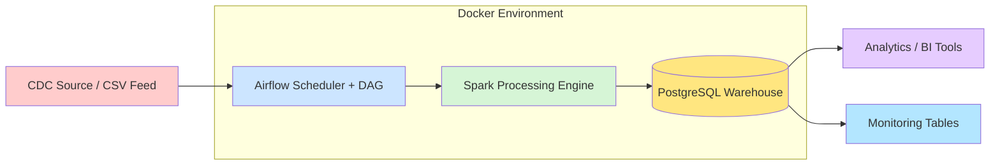

---

# Medallion Architecture

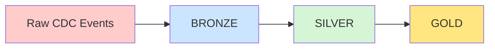

| Layer | Description |
|------|-------------|
Bronze | Raw CDC ingestion |
Silver | Cleaned + deduplicated data |
Gold | Curated analytical tables |

---

# End-to-End Data Flow

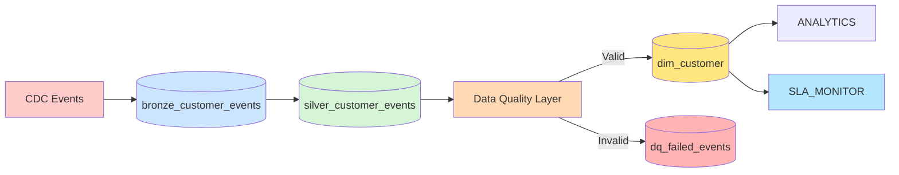

---

# Airflow Pipeline

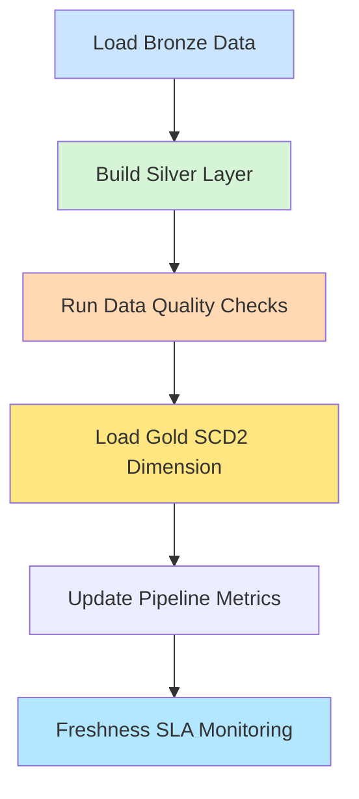

---

# Incremental SCD2 Logic

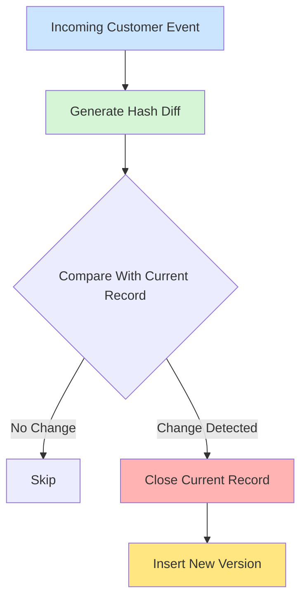

---

# Late Arriving Event Handling

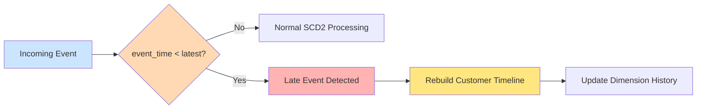

---

# Data Quality Layer

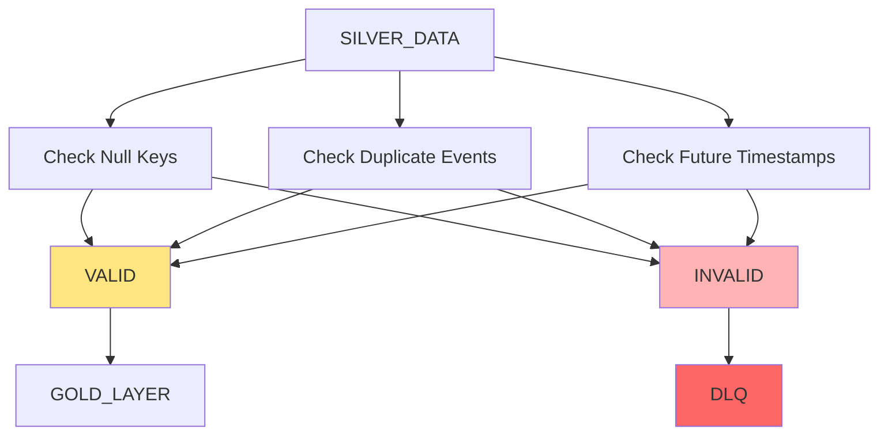

---

# Dead Letter Queue

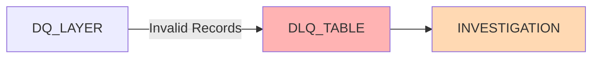

---

# Data Freshness Monitoring

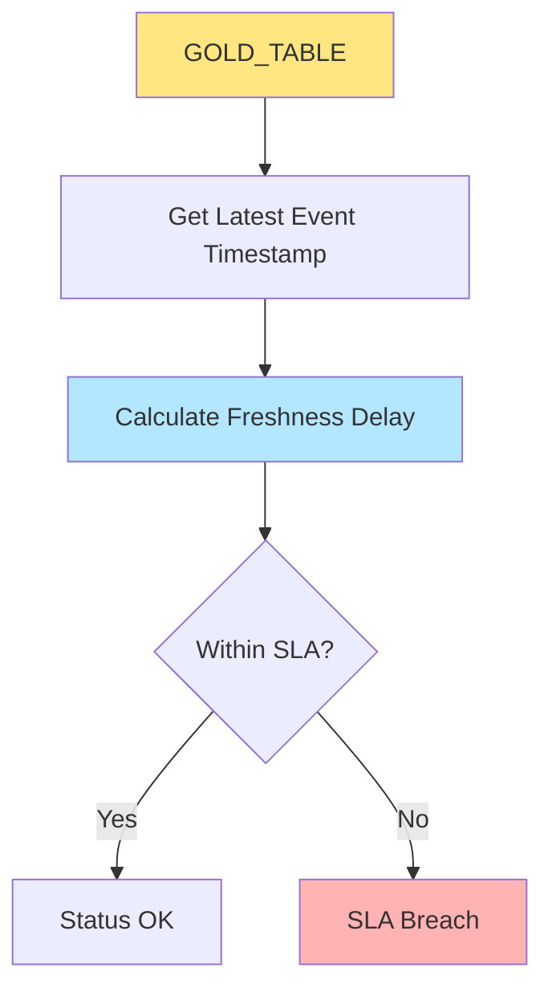

---

# Observability Architecture

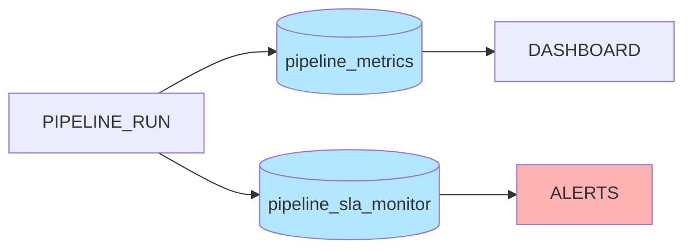

---
---

---

# Monitoring Dashboard (Metabase)

The platform includes a **Metabase monitoring dashboard** to visualize pipeline health, data quality metrics, and freshness SLA status.

Metabase connects directly to the **PostgreSQL warehouse** and reads monitoring tables generated by the pipeline.

Key monitoring tables:

```
pipeline_metrics
pipeline_sla_monitor
dq_failed_events
```

These tables are updated automatically during pipeline execution.

---

# Dashboard Architecture

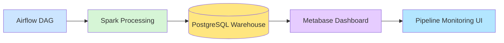

---

# Observability Data Flow

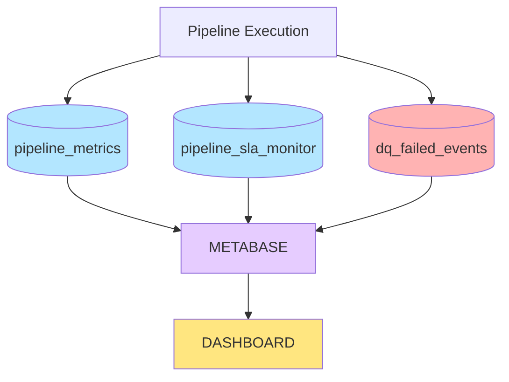

---

# Monitoring Dashboard Components

The Metabase dashboard visualizes the following pipeline health indicators.

| Dashboard Panel | Data Source |
|---|---|
Pipeline Throughput | pipeline_metrics |
SLA Freshness Status | pipeline_sla_monitor |
SLA Breaches | pipeline_sla_monitor |
Data Quality Errors | dq_failed_events |
Failed Records | dq_failed_events |

---

# Example Dashboard Layout

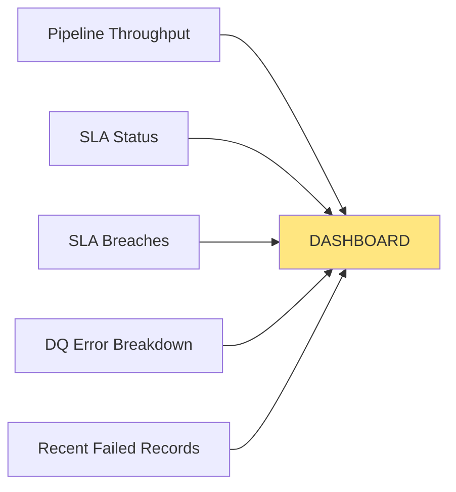

---

# Pipeline Health Metrics

The pipeline writes execution metrics into the warehouse for monitoring.

Example schema:

```sql
pipeline_metrics
(
 pipeline_name,
 run_timestamp,
 records_processed,
 records_failed,
 records_loaded
)
```

These metrics allow tracking pipeline throughput and reliability over time.

---

# Data Freshness SLA Monitoring

The pipeline continuously tracks data freshness by comparing the latest event timestamp with the current system time.

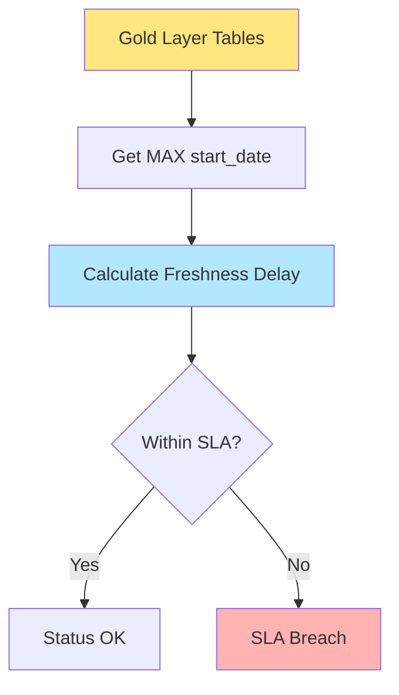

---

# Data Quality Monitoring

Invalid records are captured in a **Dead Letter Queue (DLQ)**.

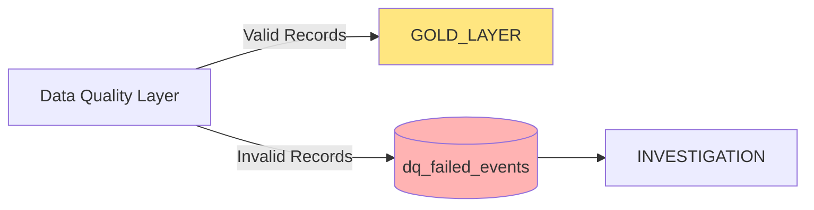

The DLQ allows the pipeline to continue processing while isolating problematic records for analysis.

---

# Metabase Container Architecture

Metabase runs as a container inside the platform's Docker environment.

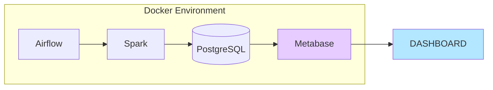

---

# Monitoring Capabilities

The monitoring dashboard provides visibility into:

- Pipeline execution throughput
- Data freshness SLA compliance
- Data quality failures
- Dead letter queue records
- Historical pipeline reliability

This observability layer enables early detection of:

- Pipeline failures
- Data freshness breaches
- Upstream ingestion issues
- Data quality regressions

---

# Resulting Platform Architecture

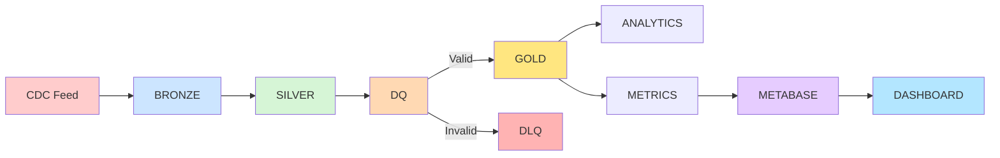

---

# Dashboard Access

Once the platform is running:

```
http://localhost:3000
```

Metabase connects to the warehouse and visualizes pipeline health automatically.

---


# Project Structure

```
ecommerce-data-platform

├── dags
│   └── ecommerce_pipeline.py
│
├── spark_jobs
│   └── load_dimensions.py
│
├── sql
│   └── create_tables.sql
│
├── data
│   ├── raw_customers.csv
│   ├── raw_products.csv
│   └── raw_orders.csv
│
├── docker-compose.yml
│
└── README.md
```

---

# Technology Stack

| Component | Technology |
|----------|-------------|
Orchestration | Airflow |
Processing | Apache Spark |
Warehouse | PostgreSQL |
Dashboard | Metabase |
Containerization | Docker |
Language | Python |

---

# Key Concepts Demonstrated

- CDC ingestion
- Medallion architecture
- Incremental SCD2
- Late arriving event handling
- Data Quality validation
- Dead letter queue
- Observability metrics
- Data freshness SLA monitoring
- Airflow orchestration
- Spark transformations

---

# Final Architecture

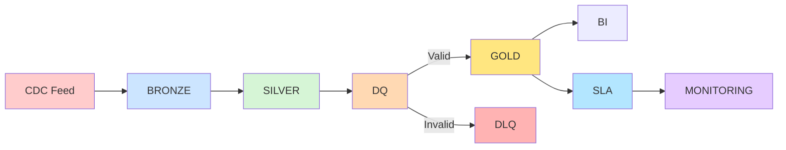

---

# Learning Outcomes

This project demonstrates real-world data engineering concepts:

- CDC ingestion
- Medallion architecture
- Incremental SCD2
- Late arriving event handling
- Data quality frameworks
- Dead letter queues
- Pipeline observability
- Data freshness monitoring
- Airflow orchestration
- Spark-based transformations