# Ecommerce Data Platform

Production-style **CDC → Medallion → Incremental SCD2 Data Platform**

Built using:

- Apache Spark
- Apache Airflow
- PostgreSQL
- Docker

Implements modern data engineering patterns:

- CDC ingestion
- Medallion architecture
- Incremental SCD2
- Late arriving event handling
- Data Quality validation
- Dead Letter Queue
- Pipeline Observability
- Data Freshness SLA monitoring

---

# Infrastructure Architecture

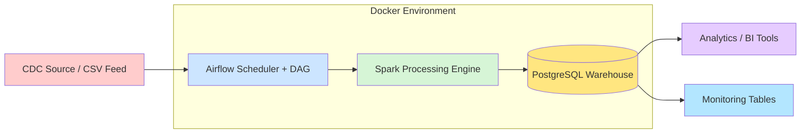

---

# Medallion Architecture

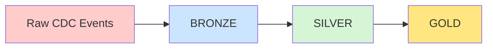

| Layer | Description |
|------|-------------|
Bronze | Raw CDC ingestion |
Silver | Cleaned + deduplicated data |
Gold | Curated analytical tables |

---

# End-to-End Data Flow

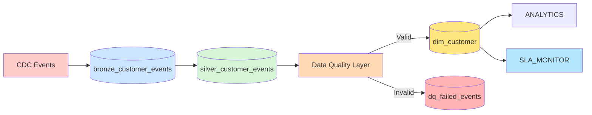

---

# Airflow Pipeline

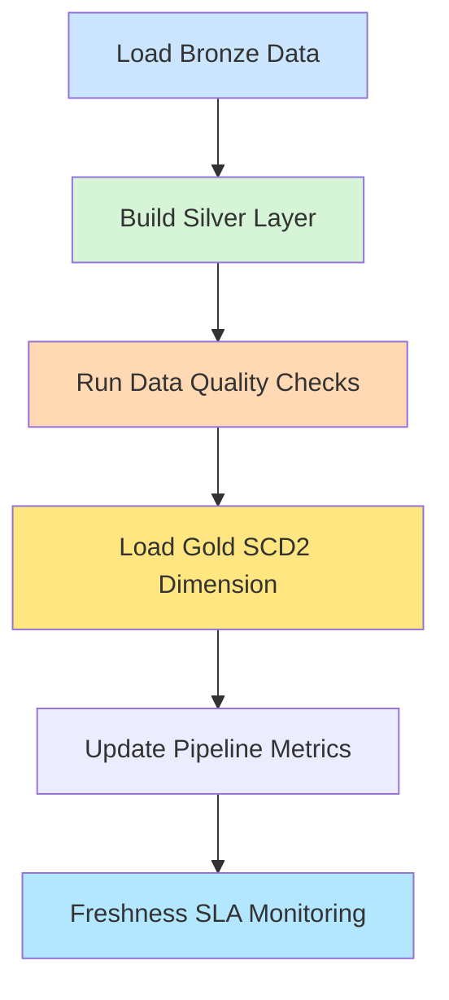

---

# Incremental SCD2 Logic

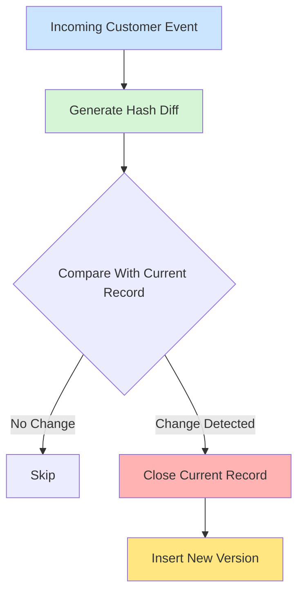

---

# Late Arriving Event Handling

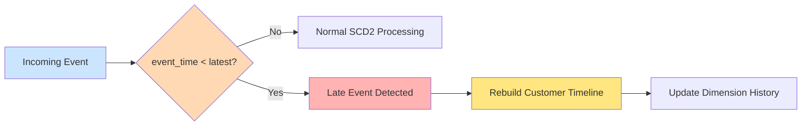

---

# Data Quality Layer

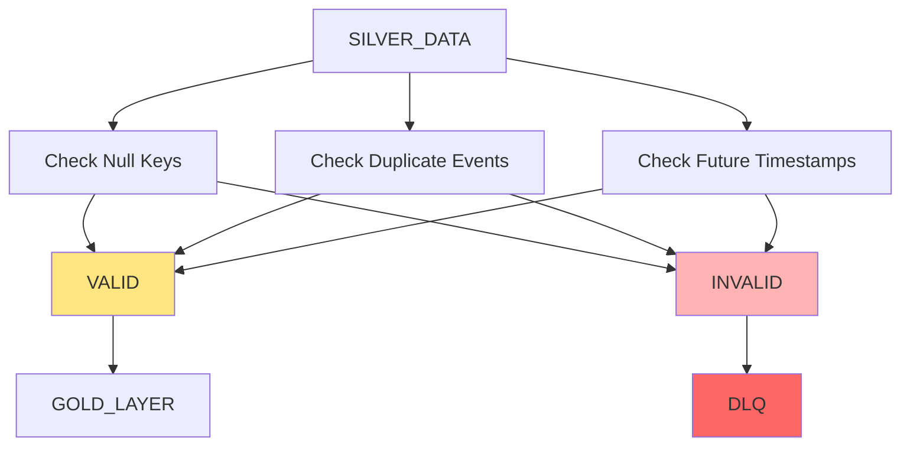

---

# Dead Letter Queue

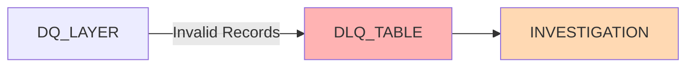

---

# Data Freshness Monitoring

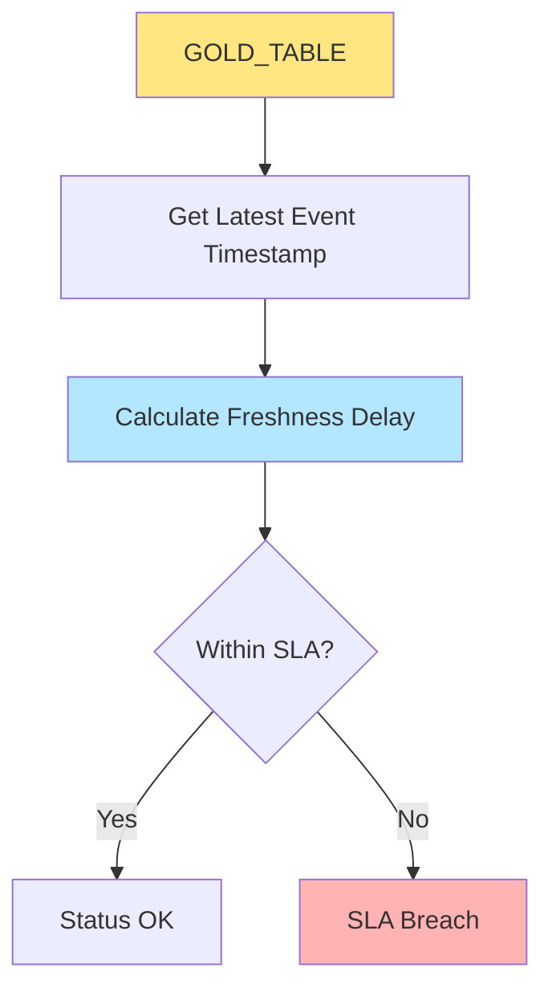

---

# Observability Architecture

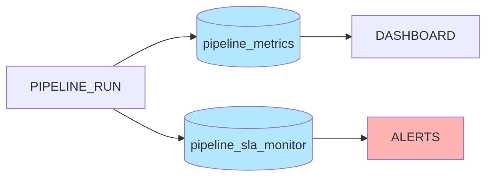

---

# Project Structure

```
ecommerce-data-platform

├── dags
│   └── ecommerce_pipeline.py
│
├── spark_jobs
│   └── load_dimensions.py
│
├── sql
│   └── create_tables.sql
│
├── data
│   ├── raw_customers.csv
│   ├── raw_products.csv
│   └── raw_orders.csv
│
├── docker-compose.yml
│
└── README.md
```

---

# Technology Stack

| Component | Technology |
|----------|-------------|
Orchestration | Airflow |
Processing | Apache Spark |
Warehouse | PostgreSQL |
Containerization | Docker |
Language | Python |

---

# Key Concepts Demonstrated

- CDC ingestion
- Medallion architecture
- Incremental SCD2
- Late arriving event handling
- Data Quality validation
- Dead letter queue
- Observability metrics
- Data freshness SLA monitoring
- Airflow orchestration
- Spark transformations

---

# Final Architecture

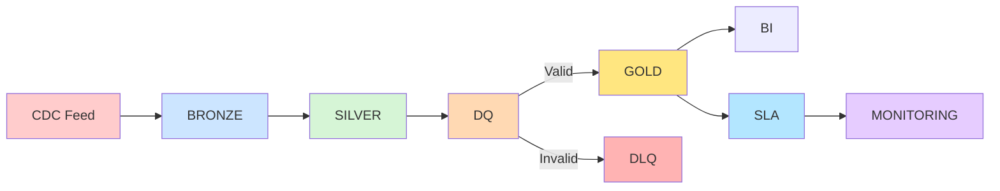

---

# Learning Outcomes

This project demonstrates real-world data engineering concepts:

- CDC ingestion
- Medallion architecture
- Incremental SCD2
- Late arriving event handling
- Data quality frameworks
- Dead letter queues
- Pipeline observability
- Data freshness monitoring
- Airflow orchestration
- Spark-based transformations